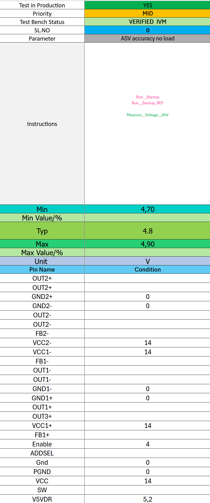
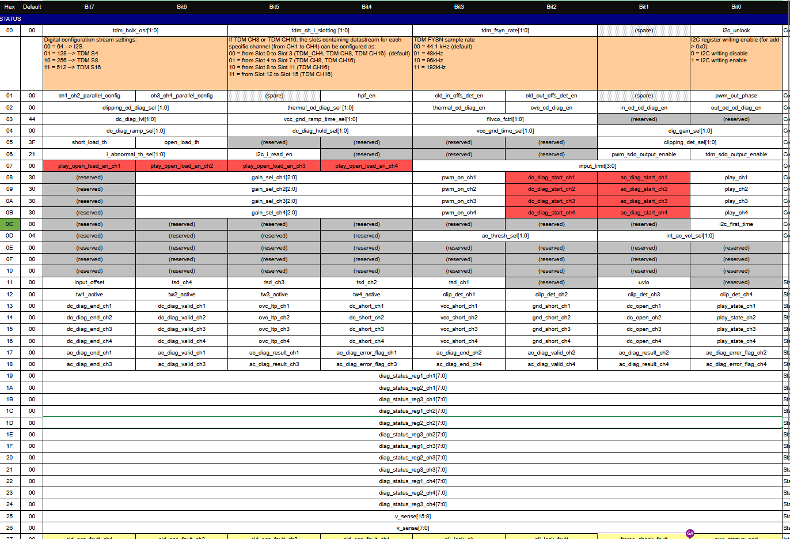

## Transformation of ATE Test Form with dfttools Integration

### 1. **Overview**

This report documents the transformation of a traditional ATE test form (illustrated by the image) into an automated, executable Python script and structured JSON format. The transformation leverages the dfttools library to enable hardware interaction, simulation, and advanced trigger capabilities.

### 2. **Comparison: ATE Test Form vs. Transformed Code/JSON**

| Aspect | Image/Table (Manual) | Transformed Code/JSON (Automated) |
| :-- | :-- | :-- |
| Readability | High (for humans) | High (for humans and machines) |
| Executable | No | Yes |
| Automation | Manual | Fully automatable |
| Traceability | Limited | Complete (all data in one place) |
| Simulation Support | No | Yes (via `expected_value`/callbacks) |
| Hardware Interaction | Manual | Automated (via `dfttools`) |
| Error Prone | High (manual entry) | Low (scripted, repeatable) |
| Customer Sharing | Yes (but not executable) | Yes (executable, transparent) |
| Pin Mapping | Table | Structured list (easy to parse/use) |
| Test Types | Limited (e.g., just accuracy) | Expanded (force, measure, sweep, trigger) |
| I2C Support | No | Yes (Read/Write) |
| Reusability | Low | High |

---

### 3. **JSON Data Structure (Example: `A5V_Accuracy_No_Load`)**

The JSON structure encodes metadata, limits, and pin mappings for the test:

```json
{
  "_id": { "$oid": "" },
  "name": "A5V_Accuracy_No_Load",
  "code": "
Test_Name = 'A5V_Accuracy_No_Load'
print(f'............{Test_Name} ........')
from dfttools import *
import random
from Procedures import Startup,Startup_REF

Typical_value = 4.8 # 4.8V
High_Limit = 4.9
Low_Limit = 4.7 
error_spred = 0.15
# measure the A5V and provide some random value for similation purpose 
# between -error_spred and +error_spred random biase value added or removed it is just for simulation purpose 
# In lab setup VMEASURE function must return the measured value of A5V
a5v_value = VMEASURE(signal=A5V, reference=GND1-, expected_value=Typical_value + random.uniform(-error_spred,error_spred)) 

#]+ check the limit
if Low_Limit < a5v_value < High_Limit:
 print(f'......... {Test_Name} PASSED .......')
else:
 print(f'......... {Test_Name} FAILED .......')
  
  
print(f'Low: {Low_Limit}V, Typ: {Typical_value}V, High: {High_Limit}V')
print(f'Measured Value : {a5v_value}V')
error_percentage = abs(a5v_value - Typical_value) / abs(Typical_value) * 100
print(f'Error Percentage {error_percentage}%')",  // Python code for the test
  "engineerinfo": {
    "date": "",
    "email": "",
    "engineer": ""
  },
  "pinmapdata": [
    { "pinname": "OUT2+", "pinno": 1, "unit": "", "value": "" },
    { "pinname": "OUT2+", "pinno": 2, "unit": "", "value": "" },
    { "pinname": "GND1-", "pinno": 13, "unit": "", "value": "" },
    { "pinname": "A5V", "pinno": 60, "unit": "", "value": "" },
    // ... other pins
    { "pinname": "VCC2+", "pinno": 64, "unit": "V", "value": "14" }
  ],
  "priority": "High",
  "stage": "Compiled"
}
```


### 4. **Transformed Python Script (Example: `A5V_Accuracy_No_Load.py`)**
#### 1. **Procedures Pins Parsing fron Json Data (Example : `from Procedures import Startup` & `Startup.py`)**
Symbols in the Code (Transforming symbols to Strings Vice versa, Pin name (VCC) and field names trasformed into dictionaries during script execution)

```python
# import the dfttool functionalities

print(f'... Startup Procedure ......')

from dfttools import VFORCE

# force 14V on "VCC" pin wrt "GND1+"

VFORCE(signal="VCC",reference="GND1-",value=14) 
```
#### 2. **Procedures fields parsing (Example : `from Procedures import Startup_REF` & `Startup_REF.py`)**
Symbols in the Code (Transforming symbols to Strings Vice versa, field names (i2c_page_sle) trasformed into dictionaries during script execution) .
```python
# import all the functionalities of the dfttools library

from dfttools import *

import time

print('.......... Startup_REF .........')

# force 4V on ENABLE pin wrt "GND1+"

VFORCE(signal="Enable",reference="GND1-",value=4)

VFORCE(signal="V5VDR",reference="GND1-",value=5.2)

# VFORCE(signal=VDDIO,reference="GND1-",value=1.8)

# enable pll 

I2C_WRITE( device_address=0x68, field_info={'fieldname': 'i2c_page_sel', 'length': 2, 'registers': [{'REG': '0xFE', 'POS': 0, 'RegisterName': 'Page selection', 'RegisterLength': 8, 'Name': 'i2c_page_sel', 'Mask': '0x1', 'Length': 1, 'FieldMSB': 0, 'FieldLSB': 0, 'Attribute': '0000000N', 'Default': '00', 'User': '000000YY', 'Clocking': 'SMB', 'Reset': 'C', 'PageName': 'PAG0'}, {'REG': '0xFE', 'POS': 0, 'RegisterName': 'Page selection', 'RegisterLength': 8, 'Name': 'i2c_page_sel', 'Mask': '0x1', 'Length': 1, 'FieldMSB': 0, 'FieldLSB': 0, 'Attribute': '0000000N', 'Default': '00', 'User': '000000YY', 'Clocking': 'SMB', 'Reset': 'C', 'PageName': 'PAG1'}]}, write_value=0x00)

I2C_WRITE( device_address=0x68, field_info={'fieldname': 'i2c_unlock', 'length': 1, 'registers': [{'REG': '0x00', 'POS': 0, 'RegisterName': 'Config REG1', 'RegisterLength': 8, 'Name': 'i2c_unlock', 'Mask': '0x1', 'Length': 1, 'FieldMSB': 0, 'FieldLSB': 0, 'Attribute': 'NNNNNNNN', 'Default': '00', 'User': '000YYYYY', 'Clocking': 'FRO', 'Reset': 'C', 'PageName': 'PAG0'}]}, write_value=0x01)

I2C_WRITE( device_address=0x68, field_info={'fieldname': 'tdm_fsyn_rate', 'length': 2, 'registers': [{'REG': '0x00', 'POS': 2, 'RegisterName': 'Config REG1', 'RegisterLength': 8, 'Name': 'tdm_fsyn_rate[1:0]', 'Mask': '0xC', 'Length': 2, 'FieldMSB': 1, 'FieldLSB': 0, 'Attribute': 'NNNNNNNN', 'Default': '00', 'User': '000YYYYY', 'Clocking': 'FRO', 'Reset': 'C', 'PageName': 'PAG0'}]}, write_value=0x01)

I2C_WRITE( device_address=0x68, field_info={'fieldname': 'unlock_tst_addr', 'length': 1, 'registers': [{'REG': '0xF7', 'POS': 0, 'RegisterName': 'Unlock register', 'RegisterLength': 8, 'Name': 'unlock_tst_addr', 'Mask': '0x1', 'Length': 1, 'FieldMSB': 0, 'FieldLSB': 0, 'Attribute': '0000000R', 'Default': '00', 'User': '00000000', 'Clocking': 'FRO', 'Reset': 'C', 'PageName': 'PAG0'}]}, write_value=0xAA)

I2C_WRITE( device_address=0x68, field_info={'fieldname': 'unlock_tst_addr', 'length': 1, 'registers': [{'REG': '0xF7', 'POS': 0, 'RegisterName': 'Unlock register', 'RegisterLength': 8, 'Name': 'unlock_tst_addr', 'Mask': '0x1', 'Length': 1, 'FieldMSB': 0, 'FieldLSB': 0, 'Attribute': '0000000R', 'Default': '00', 'User': '00000000', 'Clocking': 'FRO', 'Reset': 'C', 'PageName': 'PAG0'}]}, write_value=0xBB)

I2C_WRITE( device_address=0x68, field_info={'fieldname': 'i2c_page_sel', 'length': 2, 'registers': [{'REG': '0xFE', 'POS': 0, 'RegisterName': 'Page selection', 'RegisterLength': 8, 'Name': 'i2c_page_sel', 'Mask': '0x1', 'Length': 1, 'FieldMSB': 0, 'FieldLSB': 0, 'Attribute': '0000000N', 'Default': '00', 'User': '000000YY', 'Clocking': 'SMB', 'Reset': 'C', 'PageName': 'PAG0'}, {'REG': '0xFE', 'POS': 0, 'RegisterName': 'Page selection', 'RegisterLength': 8, 'Name': 'i2c_page_sel', 'Mask': '0x1', 'Length': 1, 'FieldMSB': 0, 'FieldLSB': 0, 'Attribute': '0000000N', 'Default': '00', 'User': '000000YY', 'Clocking': 'SMB', 'Reset': 'C', 'PageName': 'PAG1'}]}, write_value=0x01)

I2C_WRITE( device_address=0x68, field_info={'fieldname': 'force_pll_en', 'length': 1, 'registers': [{'REG': '0x20', 'POS': 5, 'RegisterName': 'Analog test 3', 'RegisterLength': 8, 'Name': 'force_pll_en', 'Mask': '0x20', 'Length': 1, 'FieldMSB': 5, 'FieldLSB': 5, 'Attribute': 'NNNNNNNN', 'Default': '00', 'User': '0000YYYY', 'Clocking': 'SMB', 'Reset': 'C', 'PageName': 'PAG1'}]}, write_value=0x01)

I2C_WRITE( device_address=0x68, field_info={'fieldname': 'pll_en_m', 'length': 1, 'registers': [{'REG': '0x20', 'POS': 6, 'RegisterName': 'Analog test 3', 'RegisterLength': 8, 'Name': 'pll_en_m', 'Mask': '0x40', 'Length': 1, 'FieldMSB': 6, 'FieldLSB': 6, 'Attribute': 'NNNNNNNN', 'Default': '00', 'User': '0000YYYY', 'Clocking': 'SMB', 'Reset': 'C', 'PageName': 'PAG1'}]}, write_value=0x01)

I2C_WRITE( device_address=0x68, field_info={'fieldname': 'otp_burn', 'length': 1, 'registers': [{'REG': '0x3E', 'POS': 1, 'RegisterName': 'OTP control reg 1', 'RegisterLength': 8, 'Name': 'otp_burn', 'Mask': '0x2', 'Length': 1, 'FieldMSB': 1, 'FieldLSB': 1, 'Attribute': 'RR0NNNNN', 'Default': '00', 'User': '00000000', 'Clocking': 'FRO', 'Reset': 'C', 'PageName': 'PAG1'}]}, write_value=0x01)

I2C_WRITE( device_address=0x68, field_info={'fieldname': 'i2c_page_sel', 'length': 2, 'registers': [{'REG': '0xFE', 'POS': 0, 'RegisterName': 'Page selection', 'RegisterLength': 8, 'Name': 'i2c_page_sel', 'Mask': '0x1', 'Length': 1, 'FieldMSB': 0, 'FieldLSB': 0, 'Attribute': '0000000N', 'Default': '00', 'User': '000000YY', 'Clocking': 'SMB', 'Reset': 'C', 'PageName': 'PAG0'}, {'REG': '0xFE', 'POS': 0, 'RegisterName': 'Page selection', 'RegisterLength': 8, 'Name': 'i2c_page_sel', 'Mask': '0x1', 'Length': 1, 'FieldMSB': 0, 'FieldLSB': 0, 'Attribute': '0000000N', 'Default': '00', 'User': '000000YY', 'Clocking': 'SMB', 'Reset': 'C', 'PageName': 'PAG1'}]}, write_value=0x01)
```
fields are parsed from regmap json data, which is the json conversion of excel sheet regmap.

#### 3. **Register Map in Excel**



#### 4. **JSON Format of the Regmap**

```json
{
    "fieldname": "tdm_bclk_osr",
    "length": 2,
    "registers": [
      {
        "REG": "0x00",
        "POS": 6,
        "RegisterName": "Config REG1",
        "RegisterLength": 8,
        "Name": "tdm_bclk_osr[1:0]",
        "Mask": "0xC0",
        "Length": 2,
        "FieldMSB": 1,
        "FieldLSB": 0,
        "Attribute": "NNNNNNNN",
        "Default": "00",
        "User": "000YYYYY",
        "Clocking": "FRO",
        "Reset": "C",
        "PageName": "PAG0"
      }
    ]
  },
  {
    "fieldname": "tdm_ch_i_slotting",
    "length": 2,
    "registers": [
      {
        "REG": "0x00",
        "POS": 4,
        "RegisterName": "Config REG1",
        "RegisterLength": 8,
        "Name": "tdm_ch_i_slotting [1:0]",
        "Mask": "0x30",
        "Length": 2,
        "FieldMSB": 1,
        "FieldLSB": 0,
        "Attribute": "NNNNNNNN",
        "Default": "00",
        "User": "000YYYYY",
        "Clocking": "FRO",
        "Reset": "C",
        "PageName": "PAG0"
      }
    ]
  },
  {
    "fieldname": "tdm_fsyn_rate",
    "length": 2,
    "registers": [
      {
        "REG": "0x00",
        "POS": 2,
        "RegisterName": "Config REG1",
        "RegisterLength": 8,
        "Name": "tdm_fsyn_rate[1:0]",
        "Mask": "0xC",
        "Length": 2,
        "FieldMSB": 1,
        "FieldLSB": 0,
        "Attribute": "NNNNNNNN",
        "Default": "00",
        "User": "000YYYYY",
        "Clocking": "FRO",
        "Reset": "C",
        "PageName": "PAG0"
      }
    ]
  }
```

The code in the json data **chpater 3** transformed to Python script which uses dfttools to perform measurements, Forcing,I2C_READ, I2C_WRITE **(dfttools library needs call back functions which are hadware specific)** enforce limits, and report results:

```python
Test_Name = 'A5V_Accuracy_No_Load'
print(f'............{Test_Name} ........')
from dfttools import *
import random
from Procedures import Startup,Startup_REF
'''
Run__Startup
Run__Startup_REF
Measure__Voltage__A5V
'''
Typical_value = 4.8 # 4.8V
High_Limit = 4.9
Low_Limit = 4.7 
error_spred = 0.15
# measure the A5V and provide some random value for similation purpose 
# between -error_spred and +error_spred random biase value added or removed it is just for simulation purpose 
# In lab setup VMEASURE function must return the measured value of A5V
a5v_value = VMEASURE(signal=A5V, reference=GND1-, expected_value=Typical_value + random.uniform(-error_spred,error_spred)) 

#]+ check the limit
if Low_Limit < a5v_value < High_Limit:
 print(f'......... {Test_Name} PASSED .......')
else:
 print(f'......... {Test_Name} FAILED .......')
  
  
print(f'Low: {Low_Limit}V, Typ: {Typical_value}V, High: {High_Limit}V')
print(f'Measured Value : {a5v_value}V')
error_percentage = abs(a5v_value - Typical_value) / abs(Typical_value) * 100
print(f'Error Percentage {error_percentage}%')
```


### 5. **Role of dfttools and Callbacks**

- **dfttools**: Central library for hardware functions (measurements, forcing, triggers, I2C)
- **Global Context (g)**: Manages hardware availability and callback functions.
- **Callbacks**: Implement hardware-specific logic.
- **Inline Example**:

```python
from dfttools import *

# Define callback functions (example)
def voltage_force_callback(g, signal, reference, value):
    force_hardware_available = True  # Set hardware availability dynamically
    measured_value = 3.295  # Example dynamic measurement
    
    return force_hardware_available, measured_value

# Register callbacks in global context (example)
g.hardware_callbacks = {
    'voltage_force': voltage_force_callback, # must return hardware availability and value
    'current_force': current_force_callback,
    'resistance_force': resistance_force_callback,
    'frequency_force': frequency_force_callback,
}

# Example usage: VFORCE
result_voltage = VFORCE(signal='VCC',value=1.1) # This will execute the call back and perform hardware force
print(f"Voltage Force Result: {result_voltage}") # If hardware available will print the measured value else the forced value
```


### 6. **dfttools Functionality and Integration**

- **Measurements:**
    - `VMEASURE`, `AMEASURE`, `RESMEASURE`, `FREQMEASURE`
    - Read voltage, current, resistance, frequency from signals/pins.
    - `expected_value` handles simulation scenarios.
- **Forcing:**
    - `VFORCE`, `AFORCE`, `RESFORCE`, `FREQFORCE`
    - Force voltage, current, resistance, frequency on signals/pins.
    - Callbacks handle hardware control.
- **Sweeps:**
    - `VFORCESWEEP`, `AFORCESWEEP`, `RESFORCESWEEP`, `FREQFORCESWEEP`
    - Perform sweeps of voltage, current, resistance, frequency.
    - Set `initial_value`, `end_value`, `step`, `step_time`.
    - Store results in `g.output`.
- **Triggers:**
    - `VTRIG_HL`, `VTRIG_LH`, `VTRIG_LG`, `ATRIG_HL`, `ATRIG_LH`, `ATRIG_LG`
    - Trigger based on voltage/current levels.
    - `threshold` (HL/LH), `expected_value` (for simulation).
    - Code Example:

```python
# Trigger__HL__I2SDATA2
HL_Th = 3  # 3V
LH_Th = 3.3  # 3.3V

# Force voltage, then wait for trigger (HL)
VFORCE(signal=A5V, reference=GND1-, value=4.8)
trigger = VTRIG_HL(signal=A5V, reference=GND1-, threshold=HL_Th, expected_value=a5v_forced_voltage) # Added reference

if trigger:
  print("Triggered successfully")
```

- **I2C Operations:**
    - `I2C_READ`, `I2C_WRITE`
    - Read/write data to I2C devices using specified device address and field info.
    - Used for configuration, control, or diagnostics.
- **Inline Example for I2C usage and defination**

```python
# Register callbacks in global context
g.hardware_callbacks = {
    'i2c_read': i2c_read_callback,
    'i2c_write': i2c_write_callback
}
# Test I2C operations
print("I2C Read Results:", I2C_READ( device_address=0x12, field_info=field_info1, expected_value=0x3))
print("I2C Write Results:", I2C_WRITE( device_address=0x12, field_info=field_info1, write_value=0x3))
# Test I2C operations
print("I2C Read Results:", I2C_READ( device_address=0x12, field_info=field_info2, expected_value=0x3))
print("I2C Write Results:", I2C_WRITE( device_address=0x12, field_info=field_info2, write_value=0x3))
```

---

### 7. **Benefits of Automated Transformation**

- **Automation:**
    - Scripts can be executed automatically as part of a production test flow.
    - Triggers can be used for automated fault detection or calibration.
- **Traceability:**
    - All information is encoded in a machine-readable format.
    - Easy to audit tests, limits, and results.
- **Simulation Support:**
    - `expected_value` and hardware callbacks enable testing without physical hardware.
    - Random variations in simulation help validate tests.
- **Hardware Abstraction:**
    - dfttools provides a common interface regardless of the underlying ATE hardware.
    - Hardware-specific details handled by callbacks.
- **Customer Communication:**
    - JSON and Python scripts can be shared with customers for collaboration.

---

### 8. **Best Practices**

- **Keep JSON and Python scripts synchronized.**
- **Use version control.**
- **Document all functions.**
- **Add unit tests for callbacks and trigger functions.**
- **Use hardware availability flags to control behavior.**

---

