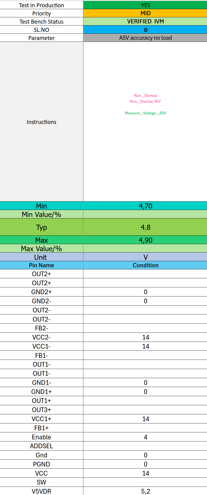

### Section 1: Existing ATE Test Form



#### Inherent Limitations:

Despite their widespread use, traditional ATE test forms possess several limitations:

* **Non-Executable:** The form itself cannot be directly executed to run the test.
* **Manual Transcription:** Requires manual transcription of test parameters and steps into an executable test script, leading to potential human errors.
* **Limited Traceability:** Tracking changes, test results, and historical data is cumbersome and often incomplete.
* **Poor Simulation Support:** Simulating test execution without access to physical hardware is challenging or impossible.
* **Lack of Dynamic Adaptability:** Difficult to adapt the test procedure dynamically based on real-time measurements or device behavior.


### Section 2: The Transformed Solution: JSON and Python-Based Test Framework

The transformation addresses the limitations of traditional ATE forms by adopting a structured and automated approach:

#### The JSON Data Structure:

The ATE test form is converted into a JSON (JavaScript Object Notation) document. JSON offers a structured, human-readable, and machine-parsable format to store test-related information:

```json
{
  "_id": { "$oid": "6800e18edc8fae6e60ba6576" },
  "name": "A5V_Accuracy_No_Load",
  "code": "\nTest_Name = 'A5V_Accuracy_No_Load'\nprint(f'............{Test_Name} ........')\nfrom dfttools import *\nimport random\nfrom Procedures import Startup,Startup_REF\n\nTypical_value = 4.8 # 4.8V\nHigh_Limit = 4.9\nLow_Limit = 4.7 \nerror_spred = 0.15\n# measure the A5V and provide some random value for similation purpose \n# between -error_spred and +error_spred random biase value added or removed it is just for simulation purpose \n# In lab setup VMEASURE function must return the measured value of A5V\na5v_value = VMEASURE(signal=A5V, reference=GND1-, expected_value=Typical_value + random.uniform(-error_spred,error_spred))\n\n#]+ check the limit\nif Low_Limit &lt; a5v_value &lt; High_Limit:\n print(f'......... {Test_Name} PASSED .......')\nelse:\n print(f'......... {Test_Name} FAILED .......')\n  \n  \nprint(f'Low: {Low_Limit}V, Typ: {Typical_value}V, High: {High_Limit}V')\nprint(f'Measured Value : {a5v_value}V')\nerror_percentage = abs(a5v_value - Typical_value) / abs(Typical_value) * 100\nprint(f'Error Percentage {error_percentage}%')",
  "engineerinfo": {
    "date": "2025-04-17T08:50:49.979Z",
    "email": "harkum@inventvm.com",
    "engineer": "Harish  Shivaramappa"
  },
  "pinmapdata": [
    { "pinname": "OUT2+", "pinno": 1, "unit": "", "value": "" },
    { "pinname": "OUT2+", "pinno": 2, "unit": "", "value": "" },
    { "pinname": "GND1-", "pinno": 13, "unit": "", "value": "" },
    { "pinname": "A5V", "pinno": 60, "unit": "", "value": "" },
    { "pinname": "VCC2+", "pinno": 64, "unit": "V", "value": "14" }
  ],
  "priority": "High",
  "stage": "Compiled"
}
```

**Key Fields in the JSON:**

* `name`: The unique identifier for the test.
* `code`: Holds the Python script for test execution (more details below).
* `engineerinfo`: Captures metadata about the test engineer.
* `pinmapdata`: An array containing information about each pin used in the test, including the pin name, pin number, unit, and value (or condition).
* `priority`: Used for test scheduling and resource allocation.
* `stage`: Indicates the stage of the test (e.g., "Compiled", "Verified", "Production").


#### The Python Test Script:

The heart of the automated test lies within the Python script, which is often embedded within the JSON structure's `"code"` field. A typical Python script exhibits the following structure:

```python
Test_Name = 'A5V_Accuracy_No_Load'
print(f'............{Test_Name} ........')

from dfttools import *
import random
from Procedures import Startup,Startup_REF

Typical_value = 4.8  # 4.8V
High_Limit = 4.9
Low_Limit = 4.7
error_spred = 0.15

a5v_value = VMEASURE(signal="A5V", reference="GND1-", expected_value=Typical_value + random.uniform(-error_spred, error_spred))

if Low_Limit &lt; a5v_value &lt; High_Limit:
    print(f'......... {Test_Name} PASSED .......')
else:
    print(f'......... {Test_Name} FAILED .......')

print(f'Low: {Low_Limit}V, Typ: {Typical_value}V, High: {High_Limit}V')
print(f'Measured Value : {a5v_value}V')
error_percentage = abs(a5v_value - Typical_value) / abs(Typical_value) * 100
print(f'Error Percentage {error_percentage}%')
```

**Key Elements of the Python Script:**

* **Import Statements:** Imports the dfttools library (`from dfttools import *`) and other standard libraries (e.g., `random`).
* **Test Setup:** Defines test parameters, such as the target voltage (`Typical_value`), acceptable limits (`High_Limit`, `Low_Limit`), and a variable to simulate noise or error (`error_spred`).
* **dfttools Functions:** Uses functions from the dfttools library (e.g., `VMEASURE`, `VFORCE`, `I2C_READ`, `I2C_WRITE`) to interact with the hardware or simulation environment.
* **Pass/Fail Logic:** Implements conditional statements to compare measured values against the specified limits and determine if the test passes or fails.
* **Reporting:** Generates informative output, including test name, measured values, pass/fail status, and error percentages.
* **Procedures and Register Map:** Calls functions related to starting up and defining the regmap .
    * **Procedures**

```python
from Procedures import Startup, Startup_REF
```

    * **Pin Declaration**

```python
VFORCE(signal="VCC",reference="GND1-",value=14)
```

    * **Regmap defination in I2C-READ,WRITE**

```python
    I2C_WRITE( device_address=0x68, field_info={'fieldname': 'i2c_unlock', 'length': 1, 'registers': [{'REG': '0x00', 'POS': 0, 'RegisterName': 'Config REG1', 'RegisterLength': 8, 'Name': 'i2c_unlock', 'Mask': '0x1', 'Length': 1, 'FieldMSB': 0, 'FieldLSB': 0, 'Attribute': 'NNNNNNNN', 'Default': '00', 'User': '000YYYYY', 'Clocking': 'FRO', 'Reset': 'C', 'PageName': 'PAG0'}]}, write_value=0x01)
```


### Section 3: The Role of dfttools Library and Hardware Callbacks

One of the most critical aspects of this framework is the use of the dfttools library. This library offers several key advantages:

* **Hardware Abstraction:** dfttools provides a high-level interface to interact with various ATE hardware platforms. The library abstracts away the hardware-specific details, allowing engineers to focus on the test logic rather than the intricacies of the test equipment.
* **Functions for Measurement, Force, and Control:** dfttools includes a comprehensive set of functions for common ATE operations, including:
    * Measurement Functions: `VMEASURE`, `AMEASURE`, `RESMEASURE`, and `FREQMEASURE`.
    * Force Functions: `VFORCE`, `AFORCE`, `RESFORCE`, and `FREQFORCE`.
    * Sweep Functions: Perform voltage, current, resistance, and frequency sweeps with configurable steps and timing.
    * Trigger Functions: Detect signal transitions (High-to-Low, Low-to-High, Low-to-Ground).
    * I2C Communication: Provides functions to conduct read and write tests on i2c lines `I2C_READ`, `I2C_WRITE`.
* **Simulation Support:** When hardware is unavailable, dfttools relies on simulated `expected_value` to perform tests in a lab condition .

**Hardware Callbacks: Bridging the Gap**

To achieve hardware abstraction and enable simulation, dfttools employs a powerful callback mechanism. Callbacks are hardware-specific functions that are registered with dfttools. These functions are invoked by dfttools to perform actual hardware operations. Here's an example:

```python
# Define a callback function for voltage forcing
def voltage_force_callback(g, signal, reference, value):
    # Code to force the specified voltage on the signal using the ATE hardware
    hardware_available = True # Replace with actual hardware availability check
    measured_value = 3.295  # Replace with measurement from hardware or a flag

    return hardware_available, measured_value

# Register the callback with dfttools
g.hardware_callbacks = {
    'voltage_force': voltage_force_callback,
    'current_force': current_force_callback,
    # ... more call backs
}

# Calling it from code
# Perform force voltage using the force back call function
result = VFORCE(signal='VCC', value=1.1)
print(f"Voltage Force Result: {result}")
```

* When `VFORCE()` is called, dfttools will check if the specified voltage is available or not by the call back.


### Section 4: From Semi-Structured Text to Structured Data

One of the core challenges is extracting information from semi-structured text, like "Test in Production," "Priority," and pin descriptions, and transforming it into a well-defined structured format within the JSON document.

* The excel sheet is used to converted to formated test code which is used to transformed into structured json code which help reduce error.


### Section 5: Enhanced Features and Functionality

As a part of report lets understand the importance of I2C and how the register are read and writen and how the triggers are set.

1. the register map is imported from json file or directly regmap values declared as in the following.
``` python
I2C_WRITE( device_address=0x68, field_info={'fieldname': 'force_pll_en', 'length': 1, 'registers': [{'REG': '0x20', 'POS': 5, 'RegisterName': 'Analog test 3', 'RegisterLength': 8, 'Name': 'force_pll_en', 'Mask': '0x20', 'Length': 1, 'FieldMSB': 5, 'FieldLSB': 5, 'Attribute': 'NNNNNNNN', 'Default': '00', 'User': '0000YYYY', 'Clocking': 'SMB', 'Reset': 'C', 'PageName': 'PAG1'}]}, write_value=0x01)
```

2. setting the trigger, In the following the vforce is used to declare value and vtrig-hl is the call back function to check the value is meeting the condition for the test.
```python
VFORCE(signal=A5V, reference=GND1-, value=4.8)
trigger = VTRIG_HL(signal=A5V, reference=GND1-, threshold=HL_Th, expected_value=a5v_forced_voltage) # Added reference
```


## 6. Conclusion

The transformation described in this document provides significant advantages over traditional test approaches:

* Increased Test Automation
* Enhanced Traceability and Reporting
* Improved Reusability
* Increased Support for Simulation
* Improved Hardware Control and I2C Implementation.

I hope the following report is more elaborate and help understand more easy. if there is more help needed let me know.

<div style="text-align: center">⁂</div>

[^1]: https://ppl-ai-file-upload.s3.amazonaws.com/web/direct-files/48677787/0ad274bf-233e-4872-9377-06348414abb7/paste.txt

